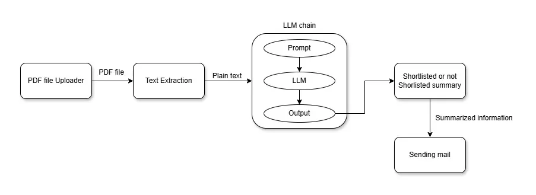
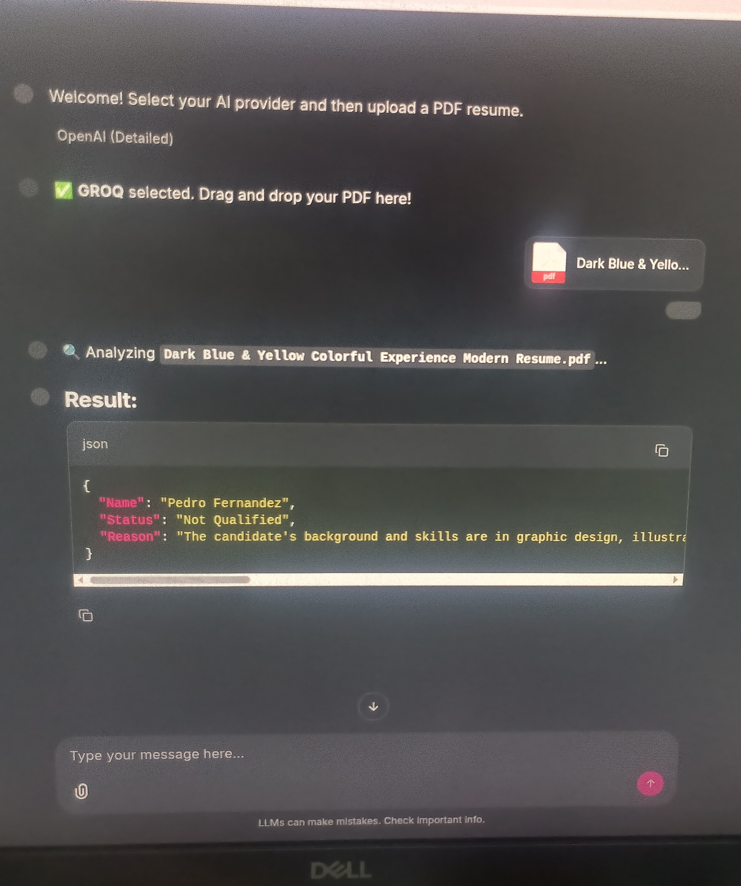

<p align="center"><a target="_blank"><h1>Precision Hiring Through Large Language Models</h1></a></p>

## About Precision Hiring Through Large Language Models 


What if an application could analyze resumes and instantly decide a candidate’s suitability for a role? Many MNCs and Tier-2 companies already use AI to streamline hiring. For beginners in Generative AI, building a resume screening application is a great way to learn hands-on while understanding AI-driven candidate shortlisting.


 Attendance Management System

Attendance Management System is a web application based on Laravel which keeps track of employee hours. It is the system you use to document the time your employees work and the time they take off.

## Major Technologies
- langchain
- groq
- Opeai
- prompts
- chainlit
- Python 3.13.5
- Ubuntu 22.04

  
##System Design


A clearly defined system architecture must be established prior to development to support scalability, maintainability, and overall system efficiency.





## Demo



### Install & Setup

To setup and install Attendance Management System project, follow the below steps:
- Clone this project by the command: 

```
$ git clone https://github.com/Anoopdata/Precision-Hiring-Through-Large-Language-Models.git
```

- Then switch to the project folder by the bellow query:

```
$ cd Precision-Hiring-Through-Large-Language-Models/chainlit_UI
```

- Option 1: Install via Deadsnakes PPA (Quickest)
The standard Ubuntu repositories don't always have the latest Python. The Deadsnakes PPA is the community standard for newer versions.

1. Update and install dependencies:
```
sudo apt update
sudo apt install software-properties-common -y
```
2. Add the repository and install Python 3.13:
``` 
sudo add-apt-repository ppa:deadsnakes/ppa
sudo apt update
sudo apt install python3.13 python3.13-venv python3.13-dev -y
```
3. Verify installation:
``` 
   python3.13 --version
```
Setting Up Your Project Environment
 
Once Python 3.13.5 is installed, you need to create an isolated environment for the Resume Shortlisting app.

1. Create a Project Folder
```
mkdir resume-screening-ai && cd resume-screening-ai

```
2. Initialize Virtual Environment
Using the Python version you just installed:
```
python3.13 -m venv venv
source venv/bin/activate
```
3. Install Project Dependencies
Now, install the libraries mentioned in your project snippet:
```
pip install flask flask-restx werkzeug langchain_community \
langchain_core langchain_groq langchain_openai python-dotenv \
pypdf

```

4. Setup Environment Variables
Create a .env file in your project root to securely store your API keys:
```

touch .env
```

Inside .env, add:
```
GROQ_API_KEY=your_groq_key_here
OPENAI_API_KEY=your_openai_key_here
gmail_password=your_app_password_here
```

Verifying the Setup
You can run a quick check to ensure the LLM chain can initialize:

# check_env.py

```
import flask
import langchain
print(f"Flask version: {flask.__version__}")
print("Environment is ready for the Resume Shortlister!")

```
**run the code **
```
chainlit run app.py -w
```

open chrome using url 


http://localhost:8000


## Screenshots


### Authors
👤 **Ali**

- GitHub: [@aliatayee](https://github.com/aliatayee)
- Twitter: [@aqaatayee](https://twitter.com/aqaatayee)


## 🤝 Contributing
Contributions, issues, and feature requests are welcome!

Feel free to check the [issues page](../../issues/).

## Show your support
Give a ⭐️ if you like this project!

## Acknowledgments
- Hat tip to anyone whose code was used
- Inspiration
- etc

## Contributing

Thank you for considering contributing to the attendance management system!.
